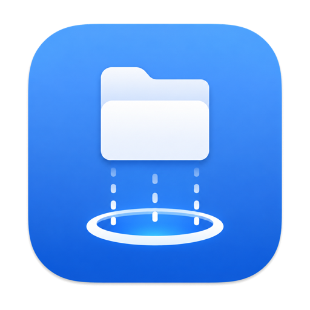

<div align="center">
  

  # Teleport

  **A free, open-source native macOS FTP, FTPS &amp; SFTP client**
  <br>
  with `tport` — a scriptable command-line client — built in.

  [](LICENSE)
  
  

  [Website](https://www.jeffcaldwell.ca/teleport/) · [Releases](https://github.com/jeffcaldwellca/Teleport/releases) · [License](LICENSE)
</div>

---

Teleport is a native SwiftUI file transfer client for macOS — a fast, modern,
open-source alternative to apps like Cyberduck, Transmit, ForkLift, and
FileZilla, for people who move files over FTP, FTPS, and SFTP and want a Mac
app that feels like one.

> **Note:** This project is unrelated to [Teleport by Gravitational](https://github.com/gravitational/teleport),
> the infrastructure access platform. This Teleport is a desktop FTP/SFTP client for macOS.

## Features

- **FTP, FTPS, and SFTP** in one client, with SSH key authentication and host-key verification
- **`tport`**, a scriptable CLI, bundled with the app and installable from Settings
- **Resume &amp; conflict handling** — interrupted transfers pick up where they left off, with overwrite/skip/if-newer policies
- **Transfer queue** for tracking multiple in-flight uploads and downloads
- **Saved connections** with Keychain-backed credential storage
- **In-place remote file editing** — edit a remote file without a manual download/upload round trip
- **Permissions editor** for `chmod`-style permission changes from the UI
- **Native SwiftUI** — built for macOS from the ground up, not a cross-platform wrapper

## `tport`, the bundled CLI

`tport` gives you the same FTP/FTPS/SFTP engine from the terminal, for
scripting deployments and automating transfers:

```sh
# List a remote directory
tport ls sftp://user@example.com/var/www

# Download a file, resuming a partial transfer
tport get sftp://user@example.com/var/www/index.html ./index.html --resume

# Upload a folder recursively, only overwriting older remote files
tport put ./dist sftp://user@example.com/var/www --recursive --on-conflict ifNewer

# Authenticate with an SSH key instead of a password
tport ls sftp://user@example.com/ --identity ~/.ssh/id_ed25519

# Check connectivity and auth only
tport test sftp://user@example.com
```

Other subcommands: `mkdir`, `rm`, `mv`, `chmod`, `chown`, `stat`. Run `tport --help`
or `tport <command> --help` for full usage. Install it from Teleport's Settings
("Install Command Line Tool"), or build it directly — see below.

## How Teleport compares

| | Teleport | Cyberduck | Transmit | ForkLift | FileZilla |
|---|---|---|---|---|---|
| Price | Free | Free | Paid | Paid | Free (Pro adds cloud) |
| Open source | ✅ GPL-3.0 | ✅ GPL-3.0 | ❌ | ❌ | ✅ GPL-2.0 |
| Native macOS UI | ✅ SwiftUI | ⚠️ Java-based | ✅ | ✅ | ⚠️ cross-platform UI |
| FTP / FTPS / SFTP | ✅ | ✅ | ✅ | ✅ | ✅ |
| Cloud storage (S3, etc.) | — | ✅ | ✅ | ✅ | Pro only |
| Scriptable CLI included | ✅ `tport` | ✅ `duck` | ❌ | ❌ | ⚠️ limited |
| macOS requirement | 14+ | 11+ | 11+ | 11+ | 10.13+ |

Teleport trades cloud-storage breadth for a smaller, focused native app: FTP,
FTPS, and SFTP done well, with a real CLI included rather than sold separately.

## Requirements

macOS 14 (Sonoma) or later.

## Installation

Download the latest signed build from the [Releases page](https://github.com/jeffcaldwellca/Teleport/releases).

### Building from source

Teleport uses [XcodeGen](https://github.com/yonaskolb/XcodeGen) to generate its Xcode project:

```sh
brew install xcodegen
xcodegen generate
open Teleport.xcodeproj
```

The CLI (`tport`) and shared engine (`TeleportKit`) are a standalone Swift package:

```sh
cd TeleportKit
swift build -c release
```

## License

Teleport is licensed under the [GNU General Public License v3.0](LICENSE).
